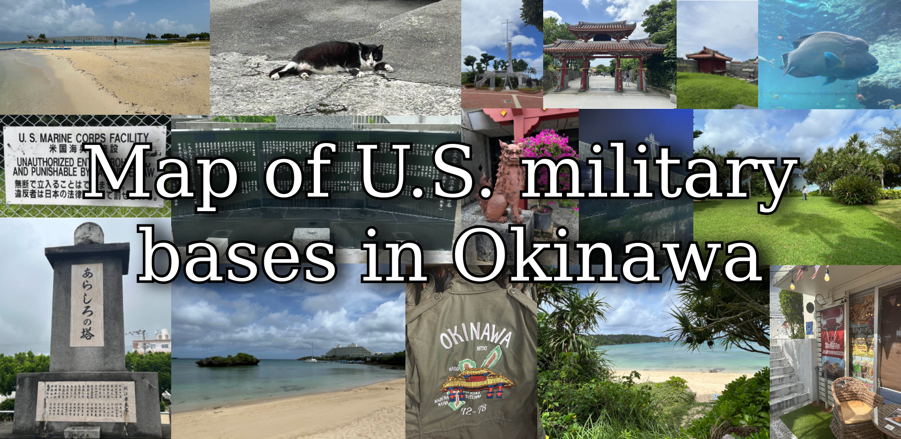

   

- - -

## Context 

This is a project I started because of my university dissertation on the presence of U.S. bases in Okinawa, Japan, and my aim was to integrate cartography with ethnography in the context of Okinawa's history of U.S. occupation. 

The goal of this repository is to provide the best and most reliable source of information on this topic by providing a historical and geographical database that existed from 1945 to 2026 for researchers to rely on.

 

## Challenges and motivation

Every map on this topic have many issues, such as missing bases, inaccurate borders, lack of base detail, missing airspaces/waterspaces, disregard for historical demolished bases, and conflicting reports.  Even the official Japanese Ministry of Defense website have these problems while showing legal borders of control instead of physical fencelines that align with realistic observations.

This motivated me to create one single encompassing map that fixes all the issues while providing quantitative and historical data on each U.S. base that ever existed. So to accompany this, I did my best to compile the correct details and discarded the incorrect ones from each source I could find to make it as accurate as possible. 

I spent approximately 150+ hours in total manually mapping the areas while binge listening to Nujabes (10/10 experience btw, would recommend). Although I did lose around 2 days worth of work due to a saving error and I'm probably on some sort of watchlist by now, it was definitely worth it :trollface:

 

## Mapping methodology

Most of the mapping was done by viewing previous maps to view the general shape and area of the target base, then trace the borders through installations of the fences using a combination of google maps, google streetview, and ArcGIS. 

The satellite imagery was sometimes fuzzy and impossible to view with the human eye, but google maps and ArcGIS both have varying clarity depending on the area and time. The difference in time when it was taken is also a very important detail, because the sun is casting shadows at different angles, and sometimes the fences can be found and identified this way.

(show example here)

## Data and sources

All the data is provided in the data_tables folder for [bases](data_tables/all_bases.xlsx) and [airspaces/waterspaces](data_tables/all_spaces.xlsx)

The majority of the sources were taken from the Japanese Wikipedia articles regarding every base. Each of them are documented on the source column of base data, but they include various different sources includes those of declassified CIA documents.

## Credits 
Feel free to use this data however you like, credit is not strictly necessary since I consider my work to be in the public domain (but a mention/link to this repo would be appreciated). 
