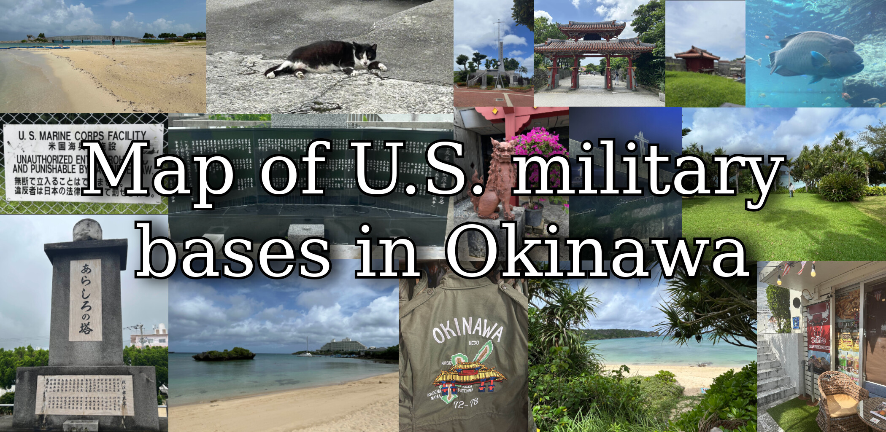
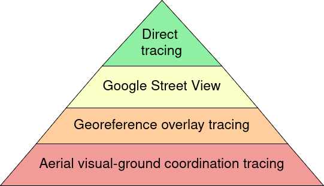
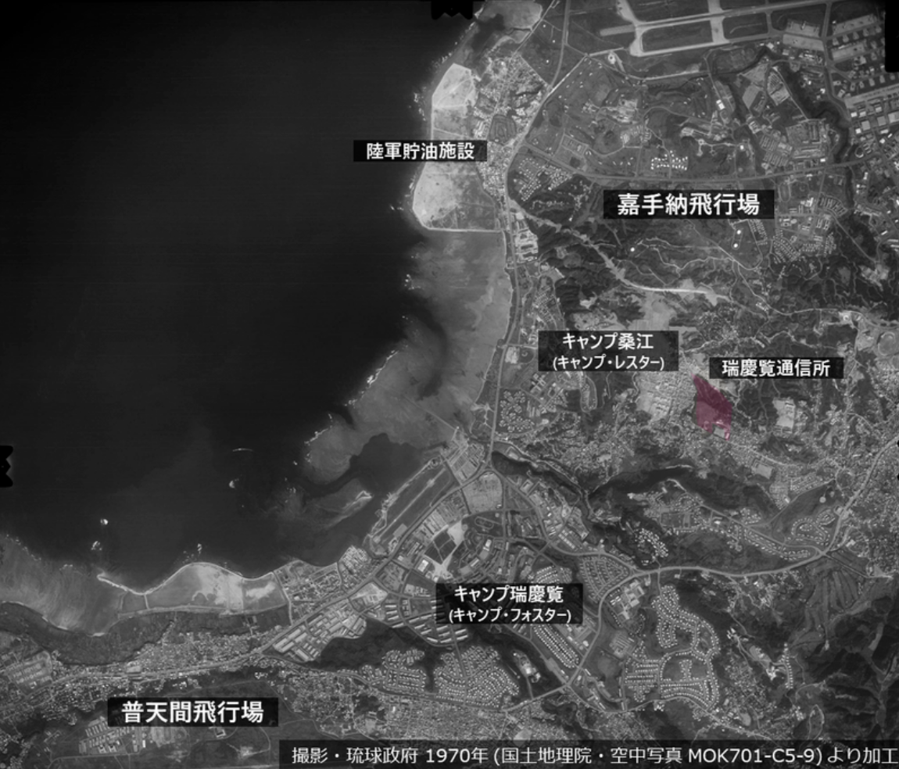
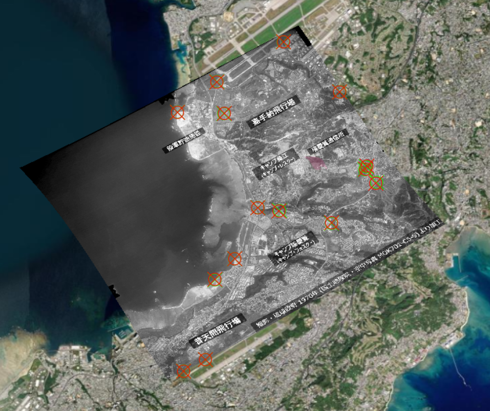
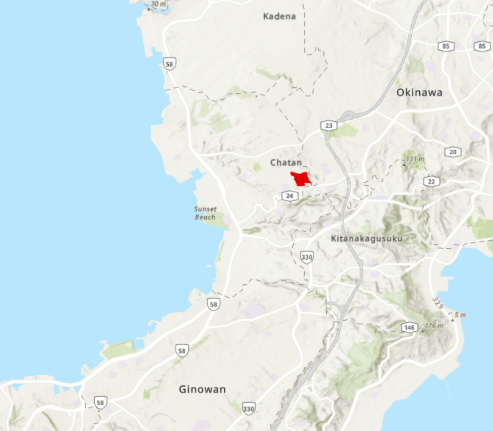
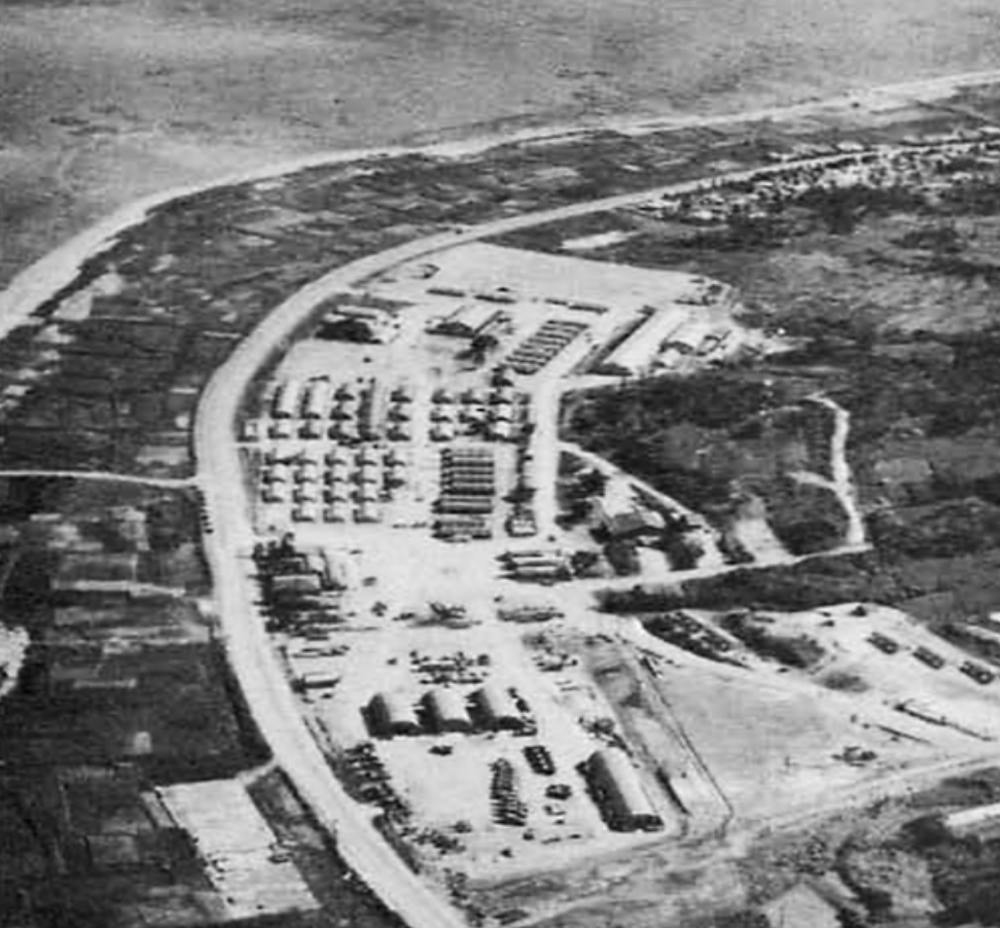
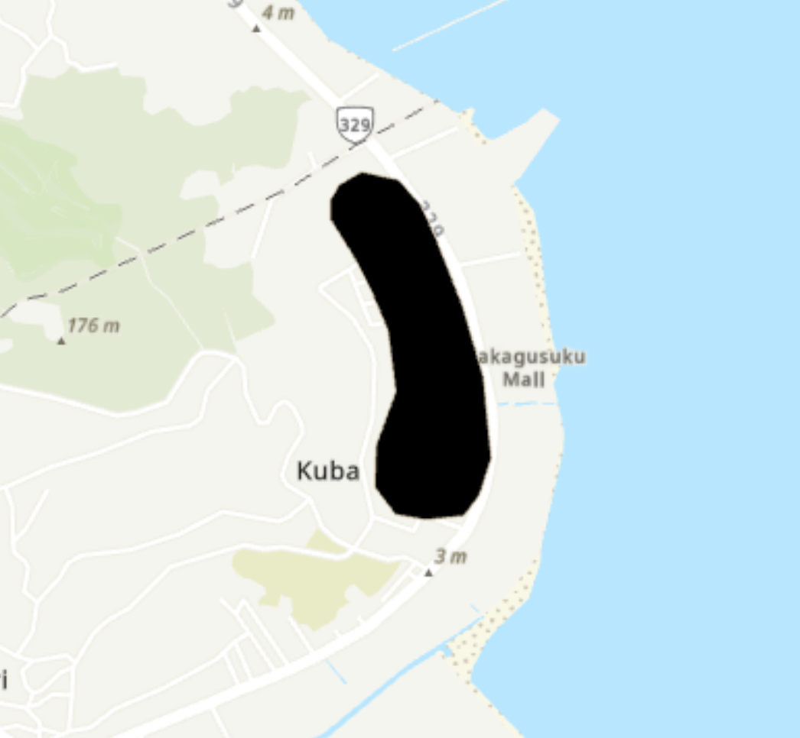

   

- - -

 

## Context 

This is a project I started because of my university dissertation on the presence of U.S. bases in Okinawa, Japan, and my aim was to integrate cartography with ethnography in the context of Okinawa's history of U.S. occupation. 

The goal of this repository is to provide the best and most reliable source of information on this topic by providing a historical and geographical database that existed from 1945 to 2026 for researchers and historians to rely on.

Every map that has ever been made on this topic has many issues, such as missing bases, inaccurate borders, lack of base detail, missing airspaces/waterspaces, omittance of previously existing bases that were demolished, and conflicting reports. Even the official Japanese Ministry of Defense website has these problems, while showing legal borders of control instead of physical fencelines that align with realistic observations on the ground.

This motivated me to create one single encompassing map that fixes all the aforementioned issues while providing quantitative and historical data on each U.S. base that has ever existed. So to accompany this, I did my best to compile the correct details and discarded the incorrect ones from each source I could find to make it as accurate as possible from my own research. 

I visited Okinawa in 2025 (travel photos shown on the banner of this README), and I spent approximately 150+ hours in total manually mapping the areas using ArcGIS while binge listening to Nujabes. 10/10 experience btw, would highly recommend. Although I'm most likely on some sort of watchlist by now, it was definitely worth it :)

 

# Mapping methodology

The tracing was done by using 4 methodologies, each with varying advantages and disadvantages. This is done through a fallback system, where the most reliable metholodgy will be used but if it isn't good enough for the specific area that's being mapped, then it goes down a level of reliability as seen here:

Show

1. **Direct tracing:** tracing the fencelines using satellite imagery is the main method to map the bases, and there are 2 main resources used for this. Firstly, ArcGIS's default satellite imagery is used to follow and trace the fencelines as objectively as possible. However, ArcGIS's resource on its satellite imagery can be outdated, and the quality can be poor at times. This is where Google Maps is used as a secondary reference tool to confirm the presence of fences in clearer quality. It also has the additional benefit of being taken when the sun is projecting sunlight at an angle where the fences can appear white rather than black as seen on ArcGIS. This makes identification far easier, so that tracing using ArcGIS and Google Maps can play in tandem as the tracing tool for the former, and the visual confirmation tool for the latter. While an estimated 60% of the map was created this way, this method is not always reliable due to reasons such as poor image quality in some areas, fence colours that are too obscure, and fences being hidden by dense vegetation and jungle trees. 

2. **Google Street View:** To solve the issue of the first methodology, Google Street View may be used to manually observe fences being placed next to roads which is a common placement for the base fences. This visual confirmation has been reliably useful at times, but some fences are not situated next to roads. However, Google Street View is not entirely useless in this case, because volunteer users and online tour guides can submit their own images to the service in places where it wouldn't be possible from roads. For example, Torii Station is an Army base located on the west coast of Okinawa, but the satellite imagery's quality for the bottom left section was too poor for the human eye to discern any fences. Using user-submitted images, many sections of the unknown borders could be spotted through user submissions of the beach adjacent to the base, and visual confirmations could be made using this method of mapping. Additionally, users on Google Maps can post reviews of the places they've visited, which can sometimes include images they've attached themselves. These images can sometimes provide many insights into the geometric details at the ground level, and fences may be spotted depending on the angle and frame. This open source format can be useful, but it often falls short mainly due to reasons stemming from lack of user submissions of the area of interest. 

3. **Georeferencing:** If Google Street View isn’t useful for the base that’s being mapped, existing maps on U.S. military bases in Okinawa are used to copy the outlines to our map. The reason why this is the third most reliable methodology is because the maps can often be inaccurate, imprecise, and incomplete. Not only do the maps only show the legally U.S.-owned territories instead of fenceline borders, they also have inconsistencies between the resources being used and they can often be inaccurate in multiple ways. While the pre-existing maps themselves are a useful starting point to have an idea where the target base is located, which military branch it belongs to, and what its general shape may look like, they are not reliable enough for mapping material. Nonetheless, if it was deemed appropriate to fall back to this option, the map resource will be used as a georeference layer with control points to distort the source map to the target map that was being made. A third-order polynomial was used to morph and match the reference map to the target map as a transparent layer using control points to precise locations on the target map (such as corners of buildings, corners of airport landing strips, road intersections, etc). This method allows us to not only solve the issue of mismatched coordinate systems to warp it correctly, but also accurately and reliably trace over the borders as seen in the reference. However, along with the aforementioned downsides, this method is only an approximation of the fencelines, not a direct trace based on confirmable real-world images. Below is an example for mapping Camp Zukeran Radio Station with this method:

| Online map reference | Georeference used | Traced result |
| -------------------- | ----------------- | ------------- |
|  |  |  |

4. **Aerial visual-ground tracing:** Lastly, if all else fails, aerial photographs are used. Some of the early bases do not have any maps associated with them that were archived or found online. However, some U.S. archives do contain aerial photographs of them, requiring the base outline to be manually traced through visual ground coordination. There are many problems with this approach, such as bad image quality, photograph angles that make georeferencing difficult to trace mentioned in the method above, and limited details on spatial geographical data. For example, Camp Kubasaki fell under this methodology category due to the scarcity of details, on top of many undocumented details surrounding it. The image shown below was taken between 1957 and 1959, and it is situated in a village called Nakagusuku. Geolocating it was not easy, as the image shown has a coastline that doesn’t appear to match with the present coastline. This also demonstrates one of the problems of this methodology of changes in geographical and topological features over time, making it harder to give exact geolocations. Overall, this is considered as the least reliable method of mapping as it is nearly guaranteed to have inaccuracies, making the tracing an approximation rather than a concrete shape that aligns with historical reality.

| Aerial photograph reference | Traced result |
| --------------------------- | ------------- |
|  |  |

# Quantitative data and sources

**Historical overview (1945-2026):**
| Area category | Number of bases/zones | Total perimeter length | Total area |
| ------------- | --------------------- | ---------------------- | ---------- |
| Waterspaces | 31 | 5351.2 km | 144297.3 km² |
| Airspaces | 23 | 6696.7 km | 186798.9 km² |
| Marine Corps | 33 | 547 km | 237.1 km² |
| Air Force | 18 | 157.4 km | 72.9 km² |
| Navy | 13 | 70.98 km | 19.1 km² |
| Army | 51 | 98.3 km | 13 km² |
| Unknown | 6 | 27.5 km | 7.7 km² |

 

**Present overview (2026):**
| Area category | Number of bases/zones | Total perimeter length | Total area |
| ------------- | --------------------- | ---------------------- | ---------- |
| Waterspaces | 31 | 5351.2 km | 144297.3 km² |
| Airspaces | 23 | 6696.7 km | 186798.km² |
| Marine Corps | 17 | 318.9  km | 160.9 km² | 
| Air Force | 7 | 108.1 km | 59 km² |
| Navy | 6 | 29.7 km | 4.9 km² |
| Army | 12 | 30.9 km | 4.1 km² |
| Unknown | 0 | 0 km | 0 km² |

 

Overall, 120 bases took up 350 km² of Okinawan territory has been used for military purposes by the U.S. since the Battle of Okinawa in 1945. For reference, Okinawa's total land area is only 1199 km², meaning that 29.1% of the island's land was designated as belonging to the U.S. military. It is worth noting that this figure includes demolished bases that don't exist anymore. Presently, only 40 of them are still standing which is 228.9 km² of territory as of 2026, which is a total reduction of 34.6%. This also means that 19% of total Okinawan inland territory is still in use for the same purposes today. 

**Complete base table:**

|   OBJECTID | BASE_NAME                                           | BRANCH           | CREATION_DATE   | DEMOLITION_DATE   | FACILITY_CODE   |   PERIMETER_KM |  AREA_METERS² |
|-----------:|:----------------------------------------------------|:-----------------|:----------------|:------------------|:----------------|---------------:|---------------:|
|          1 | Naha Air Force and Navy Auxiliary Facilities        | Air Force & Navy | 1945-01-01      | 1980-01-01        | FAC 6066        |         10.732 |       4159.98  |
|          2 | Kadena Airbase                                      | Air Force        | 1945-01-01      | nan               | FAC 6037        |         27.316 |      24770.2   |
|          3 | Okuma Recreational Area                             | Air Force        | 1947-01-01      | nan               | FAC 6004        |          4.572 |        625.359 |
|          4 | Senaha Communication Site                           | Air Force        | 1945-01-01      | 2006-01-01        | FAC 6021        |          5.078 |        758.148 |
|          5 | Kobi Sho Range (Air Force administration)           | Air Force        | 1948-01-01      | 1956-01-01        | FAC 6084        |          3.816 |       1025.6   |
|          6 | Yaedake Communication Site                          | Air Force        | 1950-01-01      | nan               | FAC 6006        |          0.862 |         20.865 |
|          7 | Irisuna Jima Firing Range                           | Air Force        | 1954-01-01      | nan               | FAC 6078        |          2.365 |        324.023 |
|          8 | Kume Jima Range                                     | Air Force        | 1978-01-01      | nan               | FAC 6080        |          0.214 |          2.75  |
|          9 | Tori Shima Firing Range                             | Air Force        | 1951-01-01      | nan               | FAC 6077        |          1.059 |         28.011 |
|         10 | Machinato Housing Area                              | Air Force        | 1977-02-28      | 1987-01-01        | FAC 6061        |          6.725 |       2702.97  |
|         11 | Naha Freezer Warehouse                              | Air Force        | 1978-03-15      | 1993-01-01        | FAC 6062        |          1.539 |        130.953 |
|         12 | Bolo Airfield                                       | Air Force        | 1945-01-01      | 1972-01-01        | FAC 6021        |         14.408 |       4449.18  |
|         13 | Bolo Point Shooting Range Nike Hercules Site 1      | Air Force        | 1945-01-01      | 1974-01-01        | FAC 6021        |          1.036 |         47.352 |
|         14 | Bolo Point Shooting Range Kadena 1st Site Mace B    | Air Force        | 1945-01-01      | 1974-06-30        | FAC 6021        |          0.763 |         35.623 |
|         15 | Sunabe Warehouse                                    | Air Force        | 1967-01-01      | 1993-01-01        | FAC 6039        |          0.383 |          8.881 |
|         16 | Miyako Jima Air Communication Facility              | Air Force        | 1950-01-01      | 1973-02-15        | FAC 6287        |          3.537 |        440.653 |
|         17 | Kadena Residential Area                             | Air Force        | 1945-01-01      | 1977-11-30        | FAC 6038        |          1.308 |        104.55  |
|         18 | Kadena Ammunition Depot District                    | Air Force        | 1945-01-01      | nan               | FAC 6022        |         71.727 |      33307.2   |
|         19 | Naha Port Facility                                  | Army             | 1945-01-01      | nan               | FAC 6064        |          6.402 |        581.288 |
|         20 | Torii Station                                       | Army             | 1945-01-01      | nan               | FAC 6036        |          6.795 |       2138.39  |
|         21 | Kadena Airbase                                      | Army             | 1945-01-01      | nan               | FAC 6037        |          1.151 |         59.684 |
|         22 | White Beach Oil Storage Facility                    | Army             | 1945-01-01      | nan               | FAC 6048        |          3.463 |        245.28  |
|         23 | Zukeran Radio Station                               | Army             | 1945-01-01      | 1976-01-01        | FAC 6045        |          1.999 |        153.137 |
|         24 | Torii Station Radio Antenna                         | Army             | 1945-01-01      | nan               | FAC 6036        |          0.264 |          2.726 |
|         25 | Gesaji Communication Site (incomplete)              | Army             | 1995-01-01      | 2015-02-27        | FAC 6007        |          3.498 |        782.866 |
|         26 | Tengan Communication Site                           | Army             | 1945-01-01      | 1983-01-01        | FAC 6030        |          4.658 |       1221.63  |
|         27 | Deragawa Communication Station                      | Army             | 1945-01-01      | 1974-01-01        | FAC 6034        |          3.505 |        366.223 |
|         28 | Machinato Service Office                            | Army             | 1945-01-01      | 1974-01-01        | FAC 6055        |          0.216 |          1.928 |
|         29 | Machinato Warehouse                                 | Army             | 1945-01-01      | 1974-01-01        | FAC 6054        |          0.223 |          2.276 |
|         30 | Urasoe Warehouse                                    | Army             | 1945-01-01      | 1975-01-01        | FAC 6059        |          0.611 |         22.651 |
|         31 | Machinato Purchasing and Contracting Office         | Army             | 1945-01-01      | 1974-01-01        | FAC 6058        |          0.427 |         10.945 |
|         32 | Machinato Supply District Auxiliary Facility        | Army             | 1968-01-01      | 1993-01-01        | FAC 6057        |          0.21  |          2.458 |
|         33 | Camp Mercy                                          | Army             | 1945-01-01      | 1974-01-01        | FAC 6053        |          2.527 |        306.247 |
|         34 | Harborview Club                                     | Army             | 1945-01-01      | 1972-01-01        | FAC 6063        |          0.572 |         15.941 |
|         35 | Yozadake Air Station                                | Army             | 1945-01-01      | 1976-01-01        | FAC 6272        |          3.135 |        217.412 |
|         36 | Camp McTureous                                      | Army             | 1945-01-01      | 1957-01-01        | FAC 6031        |          2.82  |        464.916 |
|         37 | Chinen 2nd Site                                     | Army             | 1945-01-01      | 1973-01-01        | FAC 6269        |          3.212 |        324.436 |
|         38 | Chinen 1st Site                                     | Army             | 1945-01-01      | 1973-01-01        | FAC 6268        |          1.436 |        131.393 |
|         39 | Southern Ammunition Depot                           | Army             | 1945-01-01      | 1977-01-01        | FAC 6075        |          3.02  |        231.886 |
|         40 | Corps of Engineers Office                           | Army             | 1968-01-01      | 2002-01-01        | FAC 6060        |          1.068 |         75.465 |
|         41 | Awase Storage Area                                  | Army             | 1945-01-01      | 1973-01-01        | FAC 6049        |          1.281 |         80.332 |
|         42 | Kashiji Army Annex                                  | Army             | 1954-01-01      | 1976-01-01        | FAC 6041        |          0.901 |         21.541 |
|         43 | Army POL Depot Kinbu No. 2 Tank Farm                | Army             | 1945-01-01      | nan               | FAC 6076        |          2.12  |        164.768 |
|         44 | Army POL Depot Kinbu No. 1 Tank Farm                | Army             | 1945-01-01      | nan               | FAC 6076        |          2.532 |        205.85  |
|         45 | Army POL Depot Kuwae Tank Farm No. 1                | Army             | 1945-01-01      | nan               | FAC 6076        |          2.245 |        161.704 |
|         46 | Army POL Depot Kuwae Tank Farm No. 2                | Army             | 1945-01-01      | nan               | FAC 6076        |          2.727 |        266.229 |
|         47 | Army POL Depot Kinbu No. 3 Tank Farm                | Army             | 1945-01-01      | nan               | FAC 6076        |          3.276 |        288.178 |
|         48 | Army POL Depot Tengan Booster Station               | Army             | 1945-01-01      | nan               | FAC 6076        |        nan     |        nan     |
|         49 | Army POL Depot Kuwae Booster Station                | Army             | 1945-01-01      | nan               | FAC 6076        |        nan     |        nan     |
|         50 | White Beach Katsuren Peninsula Army District (Hawk) | Army             | 1945-01-01      | 1972-01-01        | FAC 6048        |          1.047 |         44.558 |
|         51 | White Beach Kadena 2nd Site (Mace)                  | Army             | 1945-01-01      | 1976-12-31        | FAC 6048        |          0.627 |         26.028 |
|         52 | White Beach Nishihara 2nd Army Auxiliary Facility   | Army             | 1945-01-01      | 1973-01-01        | FAC 6048        |          0.583 |         25.573 |
|         53 | Nishihara Army Auxiliary Facility (Nike) B Site     | Army             | 1959-01-01      | 1973-05-01        | FAC 6047        |          0.727 |         30.95  |
|         54 | Nishihara Army Auxiliary Facility (Nike) A Site     | Army             | 1959-01-01      | 1974-01-01        | FAC 6047        |          0.838 |         33.698 |
|         55 | Kumejima Air Communication Facility                 | Army             | 1950-01-01      | 1973-01-01        | FAC 6279        |          3.361 |        116.287 |
|         56 | Yozadake Site                                       | Army             | 1945-01-01      | 1973-01-01        | FAC 6273        |          1.652 |        127.49  |
|         57 | Yozadake Army Auxiliary Facility                    | Army             | 1945-01-01      | 1974-01-01        | FAC 6074        |          0.87  |         49.471 |
|         58 | Machinato Housing Area                              | Army             | 1953-01-01      | 1977-02-28        | FAC 6061        |          6.725 |       2702.97  |
|         59 | Miyako Jima Voltac Site                             | Army             | 1956-01-01      | 1973-01-01        | FAC 6286        |          2.008 |        268.651 |
|         60 | Namihara Army Annex                                 | Army             | 1945-01-01      | 1974-01-01        | FAC 6035        |          1.127 |         87.195 |
|         61 | Naha Service Center                                 | Army             | 1945-01-01      | 1978-09-30        | FAC 6065        |          0.692 |         27.533 |
|         62 | Naha Site                                           | Army             | 1945-01-01      | 1973-01-01        | FAC 6267        |          2.742 |        164.705 |
|         63 | Naha Freezer Warehouse                              | Army             | 1945-01-01      | 1978-03-15        | FAC 6062        |          1.539 |        130.953 |
|         64 | Yomitan Army Auxiliary Facility                     | Army             | 1960-01-01      | 1974-01-01        | FAC 6025        |          1.357 |         97.379 |
|         65 | Sunabe Army Annex                                   | Army             | 1945-01-01      | 1977-01-01        | FAC 6040        |          0.775 |         35.505 |
|         66 | Koza Communication Facility                         | Army             | 1945-01-01      | 1973-01-01        | FAC 6042        |          0.31  |          2.097 |
|         67 | Yaka Rest Center                                    | Army             | 1945-01-01      | 1974-01-15        | FAC 6018        |          0.951 |         57.466 |
|         68 | Chika Site                                          | Army             | 1945-01-01      | 1996-01-01        | FAC 6023        |          2.082 |        283.049 |
|         69 | Camp Kubasaki                                       | Army             | 1945-01-01      | 1981-01-01        | FAC 6050        |          2.032 |        168.143 |
|         70 | White Beach Training Area                           | Navy             | 1945-01-01      | nan               | FAC 6048        |          9.025 |        953.887 |
|         71 | Awase Communication Station                         | Navy             | 1945-04-01      | nan               | FAC 6046        |          3.214 |        599.124 |
|         72 | Sobe Communication Site                             | Navy             | 1945-01-01      | 2006-01-01        | FAC 6026        |          3.054 |        605.754 |
|         73 | Camp Shields                                        | Navy             | 1950-01-01      | nan               | FAC 6032        |          6.389 |        835.522 |
|         74 | Yonabaru Airfield                                   | Navy             | 1945-05-01      | 1947-06-30        | UNKNOWN         |          9.652 |       4716.14  |
|         75 | Sekibi Sho Range                                    | Navy             | 1956-01-01      | nan               | FAC 6085        |          2.5   |         58.809 |
|         76 | Kobi Sho Range (Navy administration)                | Navy             | 1956-01-01      | nan               | FAC 6084        |          3.816 |       1025.6   |
|         77 | Oki Daito Jima Range                                | Navy             | 1958-01-01      | nan               | FAC 6088        |          4.778 |       1474.08  |
|         78 | Gesaji Communication Site (incomplete)              | Navy             | 1962-01-01      | 1995-01-01        | FAC 6007        |          3.498 |        782.866 |
|         79 | Camp Boone                                          | Navy             | 1945-01-01      | 1974-01-01        | FAC 6053        |          1.731 |        180.549 |
|         80 | Kume Jima Range                                     | Navy             | 1962-01-01      | 1978-01-01        | FAC 6080        |          0.214 |          2.75  |
|         81 | Naha Naval Air Facility                             | Navy             | 1945-01-01      | 1975-01-01        | FAC 6089        |         12.38  |       3727.29  |
|         82 | MCAS Futenma                                        | Marine Corps     | 1945-01-01      | nan               | FAC 6051        |         12.616 |       5814.37  |
|         83 | Camp Kinser                                         | Marine Corps     | 1949-01-01      | nan               | FAC 6056        |          8.77  |       3230.31  |
|         84 | Camp Schwab (coast)                                 | Marine Corps     | 1959-01-01      | nan               | FAC 6009        |         10.963 |       2129.36  |
|         85 | Kin Blue Training Area                              | Marine Corps     | 1972-01-01      | nan               | FAC 6020        |          4.727 |        471.993 |
|         86 | Camp Courtney                                       | Marine Corps     | 1956-01-01      | nan               | FAC 6029        |         13.793 |       1638.08  |
|         87 | Ukibaru Jima Training Area                          | Marine Corps     | 1972-01-01      | nan               | FAC 6181        |          3.841 |        368.364 |
|         88 | Tsuken Jima Training Area                           | Marine Corps     | 1945-01-01      | nan               | FAC 6082        |          1.505 |         17.546 |
|         89 | Tengan Pier                                         | Marine Corps     | 1945-01-01      | nan               | FAC 6028        |          2.133 |         29.083 |
|         90 | Henoko Ordnance Ammunition Depot                    | Marine Corps     | 1959-01-01      | nan               | FAC 6010        |          6.603 |        846.177 |
|         91 | Camp McTureous                                      | Marine Corps     | 1957-01-01      | nan               | FAC 6031        |          2.82  |        464.916 |
|         92 | Northern Training Area                              | Marine Corps     | 1958-01-01      | nan               | FAC 6001        |         88.867 |      44584.5   |
|         93 | Ie Jima Auxiliary Airfield                          | Marine Corps     | 1943-01-01      | nan               | FAC 6005        |         22.688 |      10711     |
|         94 | Camp Foster                                         | Marine Corps     | 1945-01-01      | nan               | FAC 6044        |         31.86  |       6046.77  |
|         95 | Camp Schwab (estimate)                              | Marine Corps     | 1959-01-01      | nan               | FAC 6009        |         22.514 |      24219.7   |
|         96 | Yomitan Auxiliary Airfield                          | Marine Corps     | 1944-01-01      | 2006-01-01        | FAC 6027        |          7.328 |       2453.87  |
|         97 | Camp Lester                                         | Marine Corps     | 1945-01-01      | nan               | FAC 6043        |          6.048 |        758.854 |
|         98 | Old Northern Training Area                          | Marine Corps     | 1958-01-01      | 2016-12-01        | FAC 6001        |        153.445 |      56484.2   |
|         99 | Kin Red Beach Training Area                         | Marine Corps     | 1962-01-01      | nan               | FAC 6019        |          0.72  |         13.356 |
|        100 | Gimbaru Training Area                               | Marine Corps     | 1957-01-01      | 2011-07-31        | FAC 6017        |          3.916 |        750.554 |
|        101 | Hisashi Training Area                               | Marine Corps     | 1957-01-01      | 1974-03-31        | FAC 6112        |          2.405 |        152.708 |
|        102 | Ishikawa Army Auxiliary Facility                    | Marine Corps     | 1957-01-01      | 1974-01-01        | FAC 6024        |          1.181 |         42.928 |
|        103 | Camp Hague                                          | Marine Corps     | 1945-01-01      | 1977-01-01        | FAC 6033        |          3.545 |        739.757 |
|        104 | Aha Training Area                                   | Marine Corps     | 1945-01-01      | 1998-01-01        | FAC 6102        |         13.415 |       6470.6   |
|        105 | Onna Communication Site                             | Marine Corps     | 1953-01-01      | 1996-01-01        | FAC 6013        |          4.098 |        725.164 |
|        106 | Camp Hardy                                          | Marine Corps     | 1945-01-01      | 1977-01-01        | FAC 6014        |          7.192 |       2587.09  |
|        107 | Chinen Service Area                                 | Marine Corps     | 1945-01-01      | 1974-01-01        | FAC 6071        |          6.959 |       2475.99  |
|        108 | Maejima Training Ground                             | Marine Corps     | 1945-01-01      | 1972-05-14        | FAC 6083        |         13.718 |       2398.93  |
|        109 | Iha Castle Hotel                                    | Marine Corps     | 1971-01-01      | 1979-01-01        | FAC 6090        |          1.517 |         60.01  |
|        110 | Naha Service Center                                 | Marine Corps     | 1978-09-30      | 1995-01-01        | FAC 6065        |          0.692 |         27.533 |
|        111 | Camp Hansen                                         | Marine Corps     | 1945-01-01      | nan               | FAC 6011        |         78.502 |      59628.4   |
|        112 | Yaka Rest Center                                    | Marine Corps     | 1974-01-15      | 1979-08-31        | FAC 6018        |          0.951 |         57.466 |
|        113 | Onna Site                                           | Marine Corps     | 1953-01-01      | 1975-01-01        | FAC 6215        |          2.774 |        186.195 |
|        114 | Awase Golf Course                                   | Marine Corps     | 1948-01-01      | 2010-07-31        | FAC 6044        |          4.981 |        582.04  |
|        115 | Kawata Training Area                                | UNINCORPORATED   | 1945-01-01      | 1971-01-01        | "No. 3"         |         13.035 |       5157.09  |
|        116 | Sedake Training Area                                | UNINCORPORATED   | 1945-01-01      | 1971-01-01        | "No. 8"         |          3.398 |        569.706 |
|        117 | VOA (Voice Of America) Manzamo                      | UNINCORPORATED   | 1951-01-01      | 1977-01-01        | NONE            |          4.086 |        657.968 |
|        118 | VOA (Voice Of America) Okuma                        | UNINCORPORATED   | 1951-01-01      | 1978-01-01        | NONE            |          4.068 |       1153.45  |
|        119 | Shinzato Communication Site                         | UNKNOWN          | 1945-01-01      | 1974-01-01        | NONE            |          2.952 |        207.641 |
|        120 | VOA (Voice Of America) Chatan                       | UNINCORPORATED   | 1951-01-01      | 1977-01-01        | NONE            |        nan     |        nan     |

 

**Complete airspace/waterspace table:**

|   OBJECTID | BASE_NAME                               | BORDER_TYPE       |   PERIMETER_KM |      AREA_METERS² |
|-----------:|:----------------------------------------|:------------------|---------------:|------------------:|
|          1 | Area Mike Mike                          | MARITIME_AIRSPACE |        515.457 |      1.20805e+07  |
|          2 | Area Hotel Hotel                        | MARITIME_AIRSPACE |        726.39  |      2.48647e+07  |
|          3 | Area Alpha                              | MARITIME_AIRSPACE |        369.243 |      5.28981e+06  |
|          4 | Gesaji Water Area                       | MARITIME          |         32.139 |   3458.97         |
|          5 | Northern Water Area                     | MARITIME          |          5.737 |   1549.62         |
|          6 | Awase Communication Station Water Area  | MARITIME          |          7.9   |   2078.76         |
|          7 | Tsuken Jima Water Area                  | MARITIME          |         16.08  |  11597.3          |
|          8 | Kin Red Beach Water Area                | MARITIME          |         11.109 |   1645.64         |
|          9 | Camp Schwab Water Area                  | MARITIME          |         64.725 | 146169            |
|         10 | Camp Hansen Water Area                  | MARITIME          |          2.4   |    313.39         |
|         11 | Army POL Depots Water Area              | MARITIME          |          7.011 |    797.891        |
|         12 | Camp Courtney Water Area                | MARITIME          |          9.097 |   2669.57         |
|         13 | Tengan Pier Water Area                  | MARITIME          |         13.357 |   8467.29         |
|         14 | White Beach Water Area                  | MARITIME          |        115.193 | 407843            |
|         15 | Kobi Sho Water Area and Airspace        | MARITIME_AIRSPACE |         38.841 |  96590.2          |
|         16 | Taisho Jima Water Area and Airspace     | MARITIME_AIRSPACE |         37.525 |  97554.6          |
|         17 | Kume Jima Water Area                    | MARITIME_AIRSPACE |         28.718 |  65629.5          |
|         18 | Area India India                        | MARITIME_AIRSPACE |        702.265 |      2.88246e+07  |
|         19 | Ukibaru Jima Water Area                 | MARITIME          |         10.613 |   3264.87         |
|         20 | Ie Jima Water Area                      | MARITIME          |         26.087 |  30563.4          |
|         21 | Kin Blue Beach Water Area               | MARITIME          |         10.326 |   2895.34         |
|         22 | Tori Shima Water Area and Airspace      | MARITIME_AIRSPACE |         34.918 |  97022.2          |
|         23 | Area Hotel Hotel                        | MARITIME_AIRSPACE |        726.39  |      2.48647e+07  |
|         24 | Area Alpha                              | MARITIME_AIRSPACE |        369.243 |      5.28981e+06  |
|         25 | Kume Jima Air Space                     | AIRSPACE          |        103.979 | 580195            |
|         26 | Northern Okinawa Range                  | AIRSPACE          |        470.837 |      1.36306e+07  |
|         27 | Southern Okinawa Range                  | AIRSPACE          |        468.532 |      1.42064e+07  |
|         28 | Area India India                        | MARITIME_AIRSPACE |        697.487 |      2.88261e+07  |
|         29 | Tori Shima Water Area and Airspace      | MARITIME_AIRSPACE |         34.918 |  97022.2          |
|         30 | Area Mike Mike                          | MARITIME_AIRSPACE |        515.457 |      1.20805e+07  |
|         31 | Area Golf Golf                          | AIRSPACE          |        487.38  |      1.38286e+07  |
|         32 | Ie Jima Air Space (Area 2)              | AIRSPACE          |        135.384 |      1.19423e+06  |
|         33 | Ie Jima Air Space (Area 1)              | AIRSPACE          |         63.905 | 242862            |
|         34 | Ie Jima Air Space (Area 1) DIVISION     | AIRSPACE          |         63.994 | 243963            |
|         35 | Kobi Sho Water Area and Airspace        | MARITIME_AIRSPACE |         35.025 |  97615.8          |
|         36 | Taisho Jima Water Area and Airspace     | MARITIME_AIRSPACE |         35.024 |  97608.4          |
|         37 | Idesuna Jima Airspace                   | MARITIME          |        116.665 | 801872            |
|         38 | Oki Daito Jima Water Area and Air Space | MARITIME_AIRSPACE |         35.87  | 102388            |

 

All the data and additional information is provided in the data_tables folder for [bases](data_tables/excel/all_bases.xlsx) and [airspaces/waterspaces](data_tables/excel/ll_spaces.xlsx). There is also an optional copy in csv format.

The majority of the sources were taken from the Japanese Wikipedia articles regarding every base. Each of them are documented on the source column of base data, but they include various different sources which includes those of declassified CIA documents.

# Credits
Made my kernelwernel. Crediting my work is not strictly necessary since I consider this to be in the public domain, but a mention/link to this repository would be appreciated!